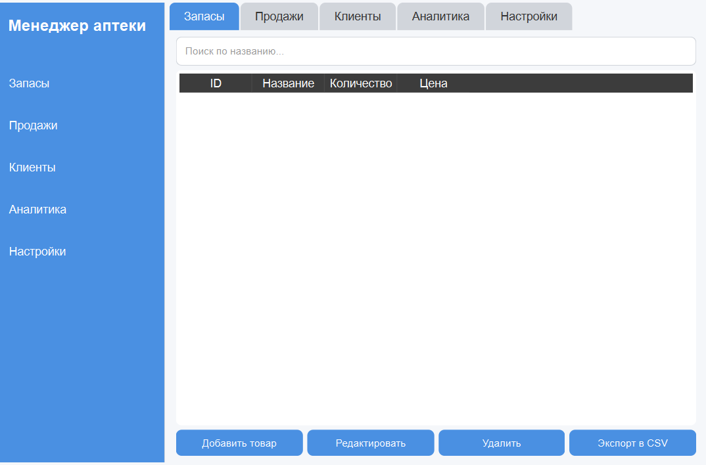

# 💊 Pharmacy Manager

[](https://python.org)
[](https://www.qt.io/)
[](LICENSE)

> 🏥 Десктопное приложение для автоматизации работы аптеки: учёт товаров, продаж, клиентов и аналитика.

---

## ✨ Возможности

| Модуль | Функции |
|--------|---------|
| 📦 Запасы | Добавление/редактирование товаров, учёт остатков, категории |
| 💰 Продажи | Оформление чеков, история транзакций, расчёт выручки |
| 👥 Клиенты | База клиентов, история покупок, скидки |
| 📊 Аналитика | Графики продаж, топ-товары, динамика выручки (Matplotlib) |
| ⚙️ Настройки | Тёмная/светлая тема, мультиязычность (RU/EN), кастомизация интерфейса |



---

## 🛠 Технологии

- **Язык**: Python 3.8+
- **GUI**: PySide6 (Qt for Python)
- **База данных**: SQLite
- **Визуализация**: Matplotlib, NumPy
- **Сборка**: PyInstaller

---

## 📦 Установка из исходников

```bash
# 1. Клонирование
git clone https://github.com/MrDobryak88/pharmacy-manager.git
cd pharmacy-manager

# 2. Виртуальное окружение
python -m venv venv
# Windows:
venv\Scripts\activate
# Linux/Mac:
source venv/bin/activate

# 3. Зависимости
pip install -r requirements.txt

# 4. Запуск
python main.py
```

> 💡 Папка `plots/` и база `pharmacy.db` создаются автоматически при первом запуске.

---

## 🗂 Сборка в .exe

```bash
pip install pyinstaller
pyinstaller --onefile --windowed main.py
```
Готовый файл — в папке `dist/`.

---

## 📁 Структура проекта

```
pharmacy-manager/
├── main.py                 # Точка входа
├── core/
│   ├── database.py         # Работа с SQLite
│   ├── config.py           # Настройки приложения
│   └── config.json         # JSON-конфиг (игнорируется в Git)
├── ui/
│   ├── main_window.py      # Основное окно
│   ├── inventory_tab.py    # Вкладка товаров
│   ├── sales_tab.py        # Вкладка продаж
│   ├── customers_tab.py    # Вкладка клиентов
│   ├── analytics_tab.py    # Графики и статистика
│   └── settings_tab.py     # Настройки интерфейса
├── assets/                 # Иконки, изображения
├── requirements.txt        # Зависимости
├── README.md              # Документация
└── .gitignore             # Исключения для Git
```

---

## 🔒 Лицензия

MIT © 2026 [MIT](https://github.com/MrDobryak88/Pharmacy-Manager/edit/main/LICENSE)

---

## 👤 Автор

**[Темура]**  
🎓 Студент-разработчик | Портфолио: [GitHub](https://github.com/MrDobryak88)  


> 💡 Проект разработан в 2025 году в рамках учебного портфолио. Архитектура приложения демонстрирует навыки модульного программирования, работы с БД и создания сложных GUI.
